# Agent Orchestrator Architecture

Agent Orchestrator is a long-running Go daemon that supervises multiple parallel AI coding agent sessions. Every session owns an isolated git worktree and one committed interface mode at a time. A TUI session runs its agent inside a tmux/conpty runtime; a Chat session runs a native protocol controller without an agent terminal runtime. Codex Chat provider processes live in a detached per-session host so daemon/desktop replacement reconnects without stopping an in-flight turn; other Chat drivers currently retain daemon-owned process lifetime. A durable handoff may move a compatible native conversation between TUI and Chat, but both controllers are never live at once. The daemon coordinates both through the same session, lifecycle, workspace, storage, and observation boundaries.

## Table of Contents

- [Mental Model](#mental-model)
- [System Overview](#system-overview)
- [Core Architectural Principles](#core-architectural-principles)
- [Component Architecture](#component-architecture)
- [Data Flows](#data-flows)
- [Persistence and CDC](#persistence-and-cdc)
- [Status Derivation](#status-derivation)
- [Lifecycle Management](#lifecycle-management)
- [Observation Loops](#observation-loops)
- [HTTP Layer](#http-layer)
- [Terminal Multiplexing](#terminal-multiplexing)
- [Browser Runtime Bridge](#browser-runtime-bridge)

---

## Mental Model

The fundamental architecture follows a simple three-stage pipeline:

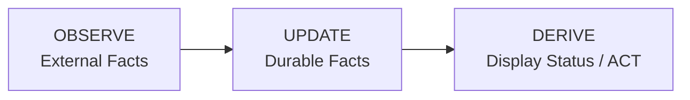

**Key insight:** Display status is never stored. It is computed at read time from durable facts.

### Durable Session Facts

The only persistent session state is:

- `activity_state` — What the agent last reported (`active`, `idle`, `waiting_input`, `blocked`, `exited`). `waiting_input` is an agent at an empty prompt awaiting its next instruction; `blocked` is an agent stopped on a pending permission/approval decision — automation must never inject input into a blocked session.
- `is_terminated` — Whether the session should be treated as over
- `session_mode` plus its runtime/provider handle and generation — The currently committed controller epoch
- `session_interface_transitions` — Durable checkpoints for an in-progress or completed TUI↔Chat handoff
- PR facts — `pr`, `pr_checks`, `pr_comment` tables

### What is NOT Durable

Display status like `working`, `needs_input`, `ci_failed`, `mergeable` are **computed at read time** by the service layer from the durable facts above.

---

## System Overview

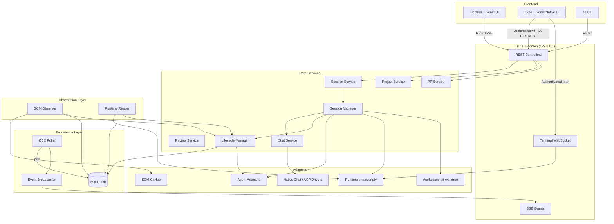

---

## Core Architectural Principles

### 1. Port-Based Design

Core code never depends on concrete implementations. All external systems are accessed through port interfaces defined in `backend/internal/ports/`:

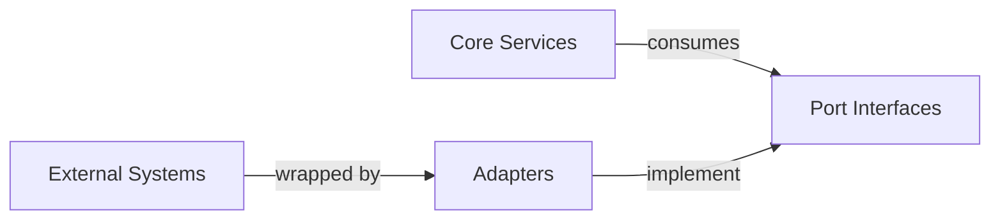

### 2. Durable Facts, Derived Status

Storage layer persists minimal facts. Service layer computes display status on-demand:

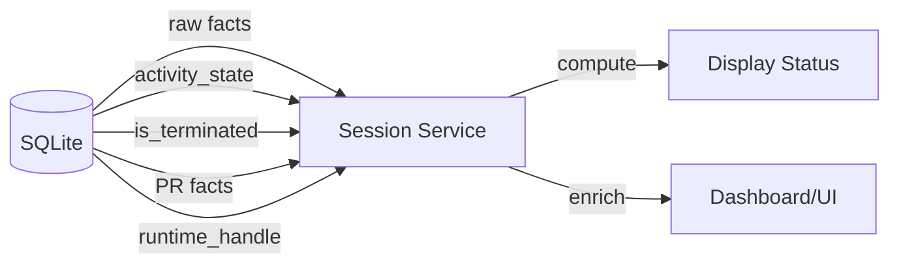

### 3. Observer Pattern

Observation is separated from action:

- **Observe layer** — SCM Observer, Runtime Reaper poll external state
- **Lifecycle layer** — Reduces observations into durable facts
- **Service layer** — Computes display status from facts

### 4. Change Data Capture

All durable changes flow through a CDC pipeline:

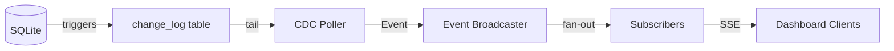

---

## Component Architecture

### Package Layout

```
backend/internal/
├── domain/              # Shared vocabulary and durable fact records
├── ports/               # Inbound/outbound interfaces
├── service/             # Controller-facing services
│   ├── project/         # Project CRUD
│   ├── session/         # Session read-model assembly
│   ├── chat/            # Chat controllers, persistent Codex hosts + durable projection
│   ├── pr/              # PR observation service
│   └── review/          # Code review service
├── session_manager/     # Internal session command engine
├── lifecycle/           # Durable session fact reducer
├── observe/             # Observation loops
│   ├── scm/             # SCM (GitHub) observer
│   └── reaper/          # Runtime liveness observer
├── storage/             # SQLite persistence
│   └── sqlite/          # DB, migrations, queries, stores
├── cdc/                 # Change-log poller and broadcaster
├── httpd/               # HTTP API, controllers, terminal mux
├── terminal/            # Terminal session protocol
├── adapters/            # Concrete adapter implementations
│   ├── agent/           # 23+ agent harnesses
│   ├── chatdriver/      # Native provider protocols and reusable ACP transport
│   ├── runtime/         # tmux/conpty runtimes
│   ├── workspace/       # git worktree
│   ├── scm/             # GitHub
│   └── tracker/         # GitHub tracker
├── daemon/              # Production wiring
└── config/              # Environment-based configuration
```

### Core Data Flow

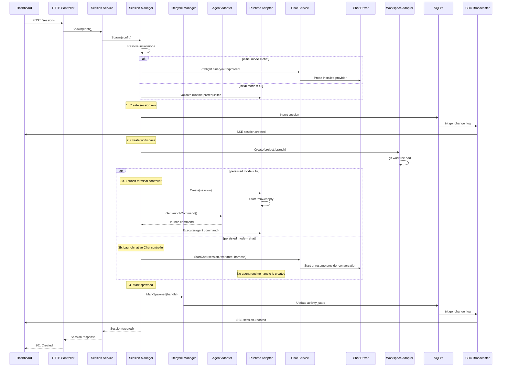

---

## Data Flows

### Session Spawn Flow

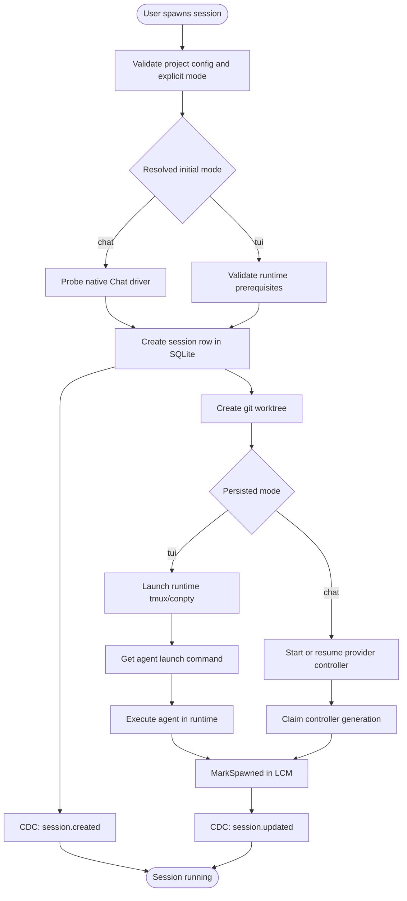

### Session Interface Handoff

An interface switch is a controller replacement inside the existing AO session,
not a new session. The session id, project, worktree, branch, lifecycle facts,
PR ownership, and provider-native conversation id stay the same. Only the
mode-owned controller changes.

The generic coordinator lives in `session_manager`; providers opt in through the
small `AgentInterfaceHandoff` capability only after their TUI resume id and Chat
protocol id are proven to name the same native conversation. Claude Code and
Codex currently satisfy that contract. Merely having a Chat/ACP driver is not
enough to enable switching for another harness.

```mermaid
sequenceDiagram
    participant Client
    participant Manager as Session Manager
    participant Lifecycle as Lifecycle Manager
    participant DB as SQLite
    participant Source as Current Controller
    participant Target as Target Controller

    Client->>Manager: POST interface-transition(target, policy)
    Manager->>DB: Claim one active transition
    alt source = Chat
        Manager->>Source: Arm handoff; close intake and queue dispatch
    else source = TUI
        Manager->>Source: Gate new terminal input
    end
    Manager->>Target: Preflight binary/auth/protocol
    alt policy = drain
        Manager->>Source: Finish accepted work
    else policy = interrupt
        Source->>DB: Cancel queued Chat turns
        Manager->>Source: Cancel active provider turn
    end
    Manager->>Source: Stop and wait for shutdown
    Manager->>Lifecycle: CommitControllerEpoch(source, target, native id)
    Lifecycle->>DB: CAS mode + clear old generation/handles + idle fact
    Manager->>Target: Native resume(same conversation id)
    Manager->>DB: Persist new handle/generation; complete transition
    DB-->>Client: session_updated CDC invalidation
```

The session row is the commit point. If target startup fails, the coordinator
CASes the row back and resumes the source. If the daemon dies mid-handoff, boot
reconciliation marks the interrupted transition for recovery and restores the
controller named by the last committed `session_mode`. Lifecycle/automation
messages received during the no-controller gap are held in a durable outbox and
delivered through whichever controller ultimately owns the session. Terminal
transition paths, transient delivery failures, and daemon restarts all retain
the message for retry; Chat retries carry a stable idempotency key. Old Chat
events are fenced by controller generation; old TUI hooks are fenced by runtime
launch id.

`drain` is loss-minimizing and may wait on an approval or user-input request;
`interrupt` synchronously closes source intake and queue dispatch at transition
acceptance. After target preflight succeeds, it settles queued Chat turns and
then sends the provider's active-turn cancellation, allows a short transcript
flush, and stops the source. The reversible first phase preserves queued work if
the target is unavailable; its dispatch fence prevents a completion callback
from promoting that work during preflight or provider cancellation. Files and
completed provider context survive.
There is no provider-neutral way to migrate a currently executing tool call or a
detached background process, and AO does not synthesize terminal screen output
into structured Chat history.

For TUI drains, AO gates new terminal input before checking quiescence. Agent
adapters that can interpret their rendered TUI report work state and composer
occupancy as separate ephemeral facts. The runtime side of that contract must
provide the current rendered viewport with ANSI cell styles: tmux uses styled
`capture-pane`, while macOS and Windows detached PTY hosts maintain a VT cell
model beside their historical replay ring. AO accepts only repeated observations
of an idle surface with an empty composer, held across the settle window; a
visible draft fails with the source untouched and requires the user to submit,
clear, or explicitly discard it. Adapter/runtime pairs without rendered-surface
support retain the causally newer idle-fact or legacy terminal-idle fallback. An
unverified idle state has a bounded proof window; active work or a user-paced
decision remains unbounded.

### Observation Flow

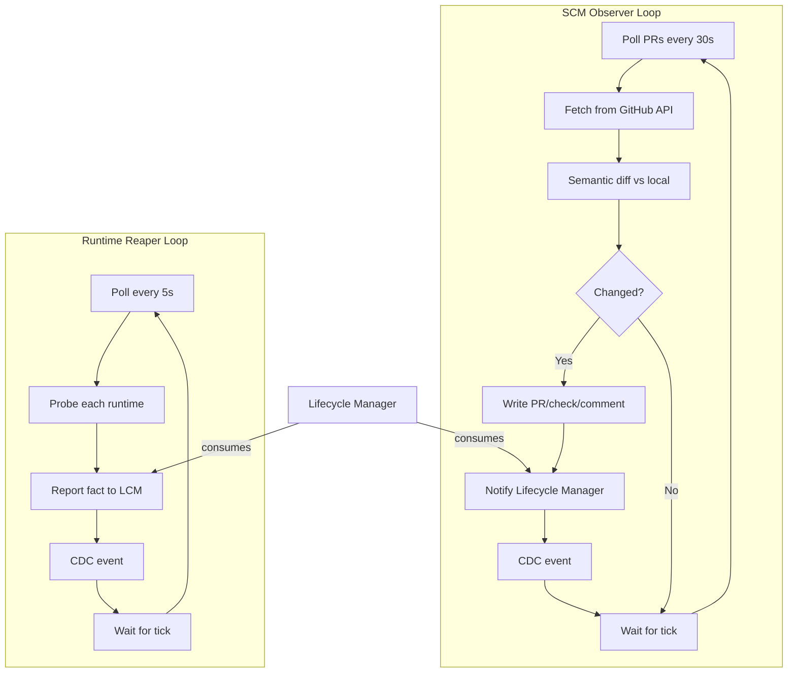

### Feedback Routing Flow

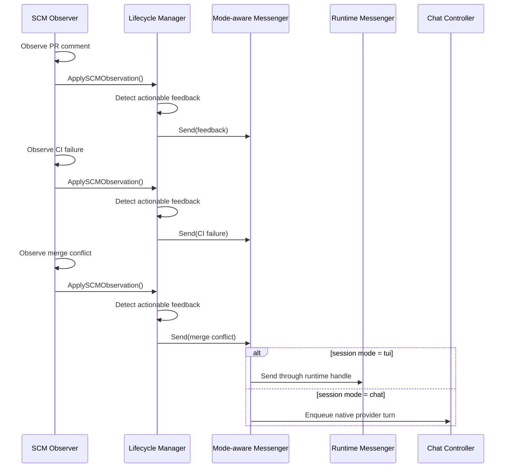

---

## Persistence and CDC

### SQLite Schema

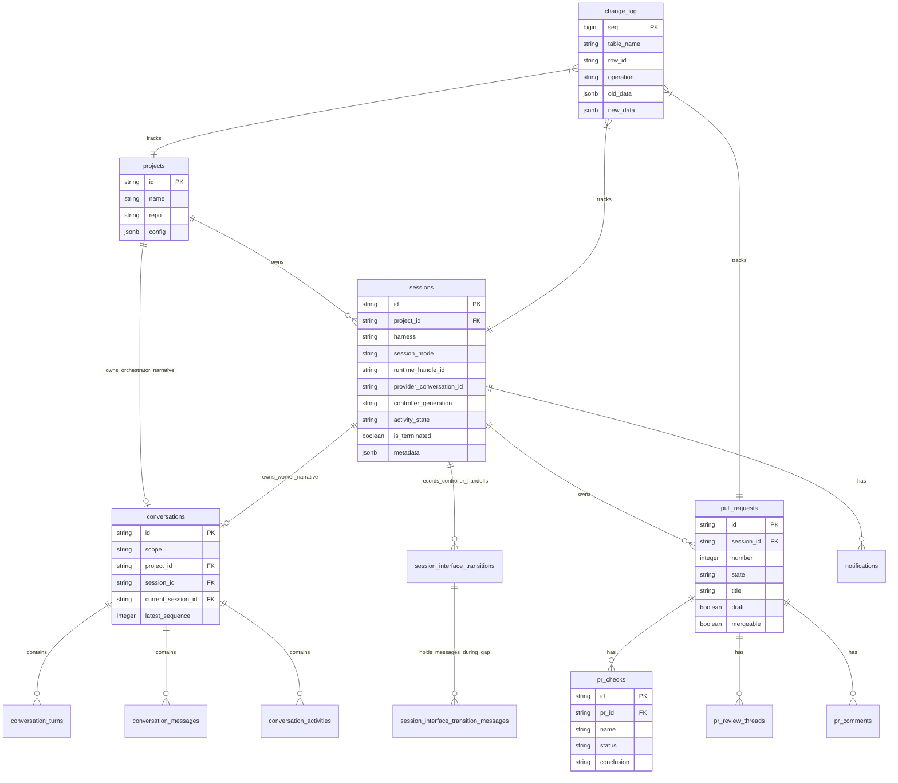

### CDC Pipeline

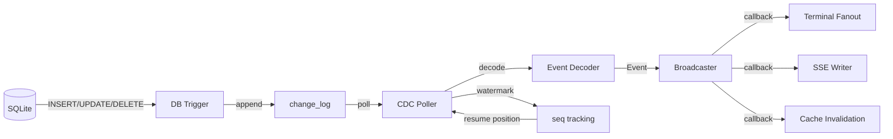

---

## Status Derivation

### Display Status Precedence

The `service.Session` computes display status from durable facts using this precedence (highest to lowest):

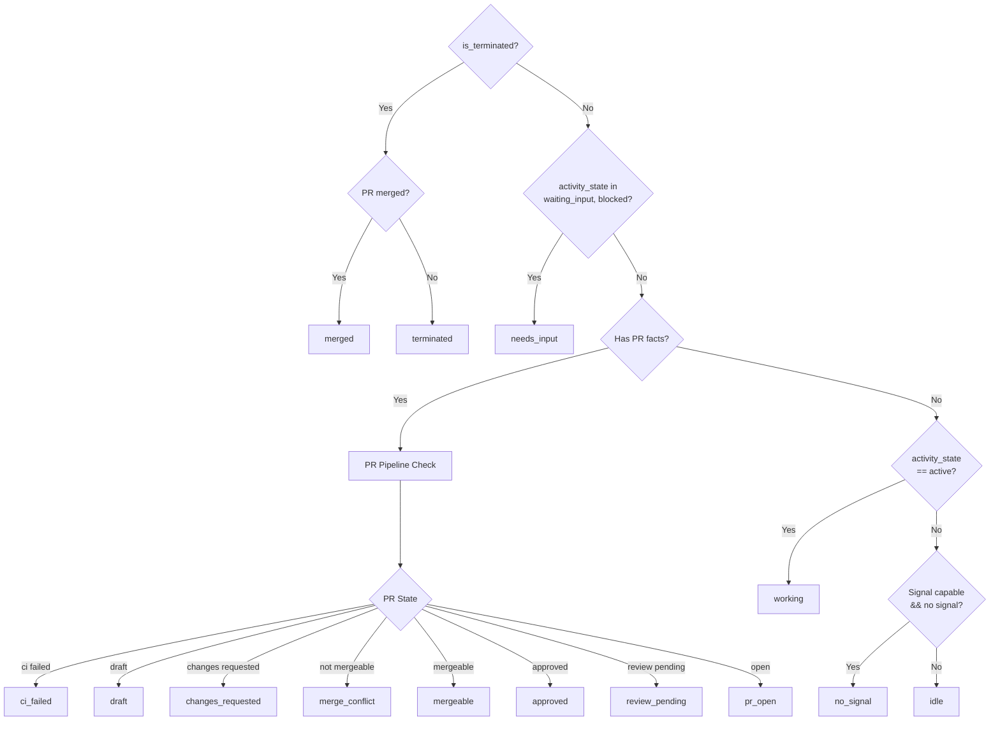

### PR Pipeline States

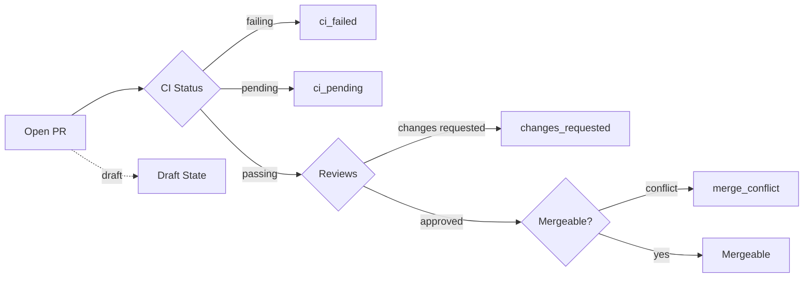

---

## Lifecycle Management

### Lifecycle Manager Responsibilities

The `lifecycle.Manager` is the **canonical write path** for all session lifecycle facts:

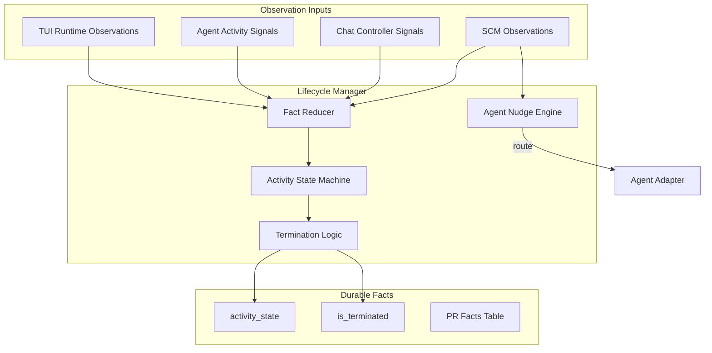

### Session State Machine

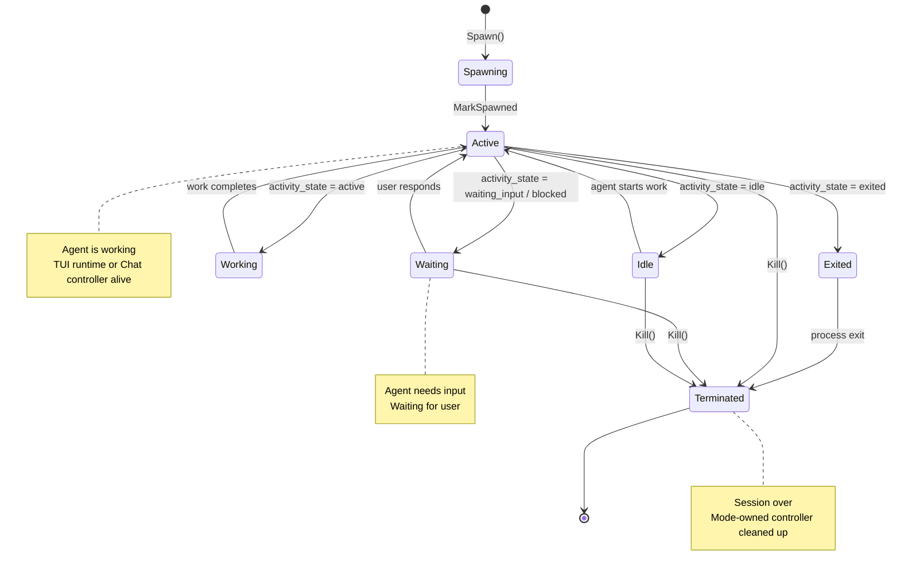

### Termination Guardrails

The lifecycle manager only terminates when **all** conditions are met:

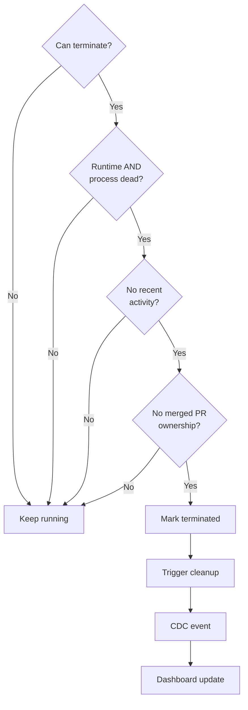

**Key principle:** Failed probes are NOT proof of death. A session is only terminated when the runtime and process are **both** clearly dead and recent activity doesn't contradict that.

---

## Observation Loops

### SCM Observer

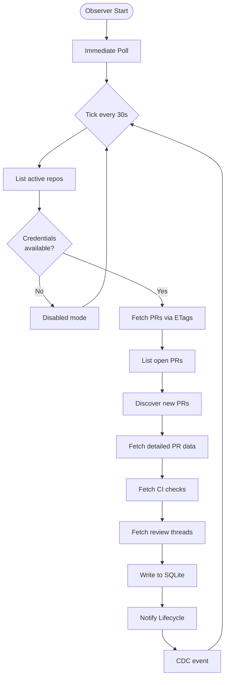

### Runtime Reaper

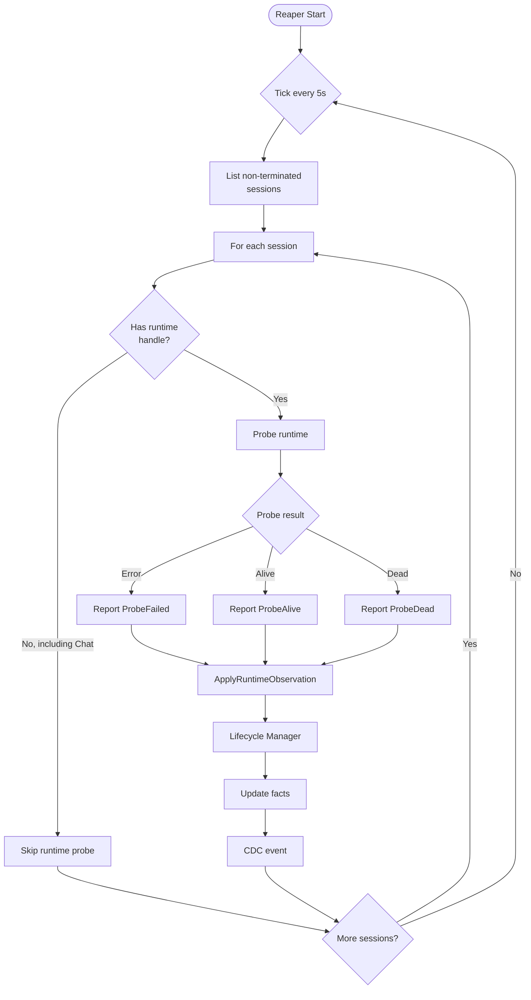

### Observation Integration

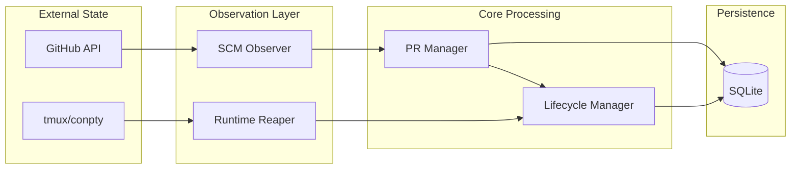

---

## HTTP Layer

### API Structure

```mermaid
flowchart TD
    subgraph HTTPD["HTTP Daemon"]
        Router[Router + Middleware]

        Router --> API[REST API]
        Router --> Events[SSE Events]
        Router --> Terminal[Terminal WebSocket]
    end

    subgraph Controllers["Controllers"]
        Sessions[Sessions Controller]
        Projects[Projects Controller]
        PRs[PRs Controller]
        Reviews[Reviews Controller]
    end

    subgraph Services["Services"]
        SessionSvc[Session Service]
        ProjectSvc[Project Service]
        PRSvc[PR Service]
        ReviewSvc[Review Service]
    end

    API --> Sessions
    API --> Projects
    API --> PRs
    API --> Reviews

    Sessions --> SessionSvc
    Projects --> ProjectSvc
    PRs --> PRSvc
    Reviews --> ReviewSvc

    Events -->|subscribe| CDC[CDC Broadcaster]
    Terminal --> TerminalMux[Terminal Manager]

```

### Multi-Listener Architecture (Loopback + LAN)

The daemon runs two independent HTTP listeners sharing the same chi router:

1. **Primary (Loopback) Listener** — binds `127.0.0.1:3001` with no authentication. All existing daemon operations (CLI, desktop app) use this listener.
2. **LAN Listener** (Connect Mobile) — an opt-in second listener that binds `0.0.0.0:3011` (or ephemeral fallback) **only when explicitly enabled** by the user through the desktop app's Settings. It wraps the shared router in bearer-password authentication middleware, serves app API routes to mobile clients, but never exposes loopback-gated control routes (`/shutdown`, telemetry, mobile control commands). All traffic is plaintext HTTP on a home network only, by deliberate security decision — see `docs/adr/0001-lan-listener-for-mobile.md` for rationale and threat model. Auth state (hashed password, per-source lockout) is persisted to `~/.ao/mobile/config.json` and restored on daemon boot.

The mobile app is a second thin renderer over those same session resources. It
branches on the session's persisted `mode`: TUI attaches the existing mux PTY,
while Chat reads the paged conversation projection and uses the durable CDC SSE
stream only for targeted invalidation/reconnect. Sends, approvals, input,
provider configuration, compaction, rollback, and shell creation remain daemon
commands; no provider or lifecycle policy is implemented in React Native.

For implementation details and security model, consult `docs/adr/0001-lan-listener-for-mobile.md` and the glossary in `CONTEXT.md`.

### Request Flow

```mermaid
sequenceDiagram
    participant Client
    participant Router
    participant Controller
    participant Service
    participant Manager
    participant Store
    participant DB

    Client->>Router: POST /api/v1/sessions
    Router->>Router: Middleware (auth, logging)
    Router->>Controller: handler(w, r)
    Controller->>Controller: decode JSON
    Controller->>Service: Spawn(config)
    Service->>Manager: Spawn(config)
    Manager->>Manager: Resolve mode and preflight its controller
    Manager->>Store: Create session
    Store->>DB: INSERT INTO sessions
    DB->>Store: session record
    Store->>Manager: session record
    Manager->>Manager: Create and provision workspace
    alt mode = tui
        Manager->>Manager: Launch terminal runtime/controller
    else mode = chat
        Manager->>Manager: Launch runtime-less Chat controller
    end
    Manager->>Service: Session response
    Service->>Controller: enriched session
    Controller->>Controller: encode JSON
    Controller->>Client: 201 Created + Session
```

---

## Terminal Multiplexing

The mux is the primary agent controller only for TUI-mode sessions. Chat-mode
sessions have no agent runtime handle and never attach their provider through
tmux. They may still open session-scoped shell terminals as a worktree escape
hatch; those shells are separate resources and do not become the agent
controller.

### Terminal Architecture

```mermaid
flowchart TD
    subgraph Frontend
        Browser[Browser Terminal]
    end

    subgraph HTTPD
        WS[WebSocket Handler]
    end

    subgraph Terminal
        Mux[Terminal Mux]
        Sessions[Session States]
    end

    subgraph Runtime
        TMux[tmux Runtime]
        MacPTY[macOS native PTY Host]
        ConPTY[conpty Runtime]
    end

    Browser -->|WebSocket| WS
    WS -->|attach| Mux
    Mux --> Sessions
    Sessions -->|create| TMux
    Sessions -->|create new macOS| MacPTY
    Sessions -->|create| ConPTY

    TMux -->|PTY attach| Mux
    MacPTY -->|loopback dial| Mux
    ConPTY -->|loopback dial| Mux

    Mux -->|frame| WS
    WS -->|binary| Browser

```

### Attach Flow

```mermaid
sequenceDiagram
    participant Client as Browser
    participant WS as WebSocket Handler
    participant Mux as Terminal Mux
    participant Runtime as tmux/conpty

    Client->>WS: WebSocket upgrade
    WS->>Mux: Attach(session, rows, cols)
    Mux->>Runtime: Attach(handle, rows, cols)

    Runtime->>Runtime: Create PTY
    Runtime->>Runtime: Spawn tmux attach

    loop Data Loop
        Runtime->>Mux: PTY output
        Mux->>WS: Binary frame
        WS->>Client: WebSocket message

        Client->>WS: User input
        WS->>Mux: Input frame
        Mux->>Runtime: Write to PTY
    end

    Client->>WS: Close
    WS->>Mux: Detach
    Mux->>Runtime: Close PTY
```

## Browser Runtime Bridge

Browser automation uses a dedicated local socket (`browser.sock` on Unix,
`ao-browser[-dev]` named pipe on Windows) between the daemon and Electron. The
daemon owns command authorization/correlation; Electron owns the actual browser
targets. Commands never use the supervisor liveness socket and never enable an
unauthenticated remote-debugging port.

Electron attaches its debugger directly to the selected session's
`WebContentsView`, so the protocol transport cannot enumerate or attach to the
AO renderer or a different session. The loopback `/api/v1/browser` surface is
blocked entirely on the opt-in LAN listener.

Request observation is an explicit, temporary browser command rather than a
standing debugger feature. Capture is off by default, bound to the active tab
that starts it, limited to 200 in-memory metadata entries, and automatically
expires within at most five minutes. AO never requests or stores request or
response bodies; it allowlists safe headers and redacts URL credentials,
fragments, and query values. Closing the tab, ending the session, or shutting
down Electron disables and discards the capture.

---

## Load-Bearing Rules

These rules are **load-bearing** — changing them breaks fundamental architectural assumptions:

1. **Never store display status** — Status is derived from durable facts at read time
2. **Never treat failed probes as death** — A failed probe is a fact, not a termination signal
3. **Never force-delete dirty worktrees** — User data safety over cleanup convenience
4. **All app state under ~/.ao** — No OS-default app-data locations
5. **Daemon binds to 127.0.0.1 only** — No network exposure, ever
6. **CLI is thin** — All logic lives in the daemon, CLI is just an HTTP client
7. **CDC is source-truth for events** — DB triggers write to change_log, poller fans out
8. **Adapters are leaves** — Adapters never import core packages, only ports and domain
9. **Hooks are gitignored** — Every file an adapter writes must be in .gitignore
10. **Migrations never change** — Add new migrations, never modify existing ones

---

## Summary

Agent Orchestrator's architecture is designed around:

- **Separation of concerns** — Observation, persistence, and display are distinct layers
- **Port-based design** — Core code depends on interfaces, not implementations
- **Durable minimalism** — Store only facts, compute everything else
- **Event-driven updates** — CDC broadcasts changes to all subscribers
- **Isolation** — Each session owns a worktree and exactly one live mode-specific controller, including across handoffs
- **Safety** — Conservative termination, path validation, gitignored hooks

This architecture enables parallel AI agents to work safely while maintaining complete visibility and control.
