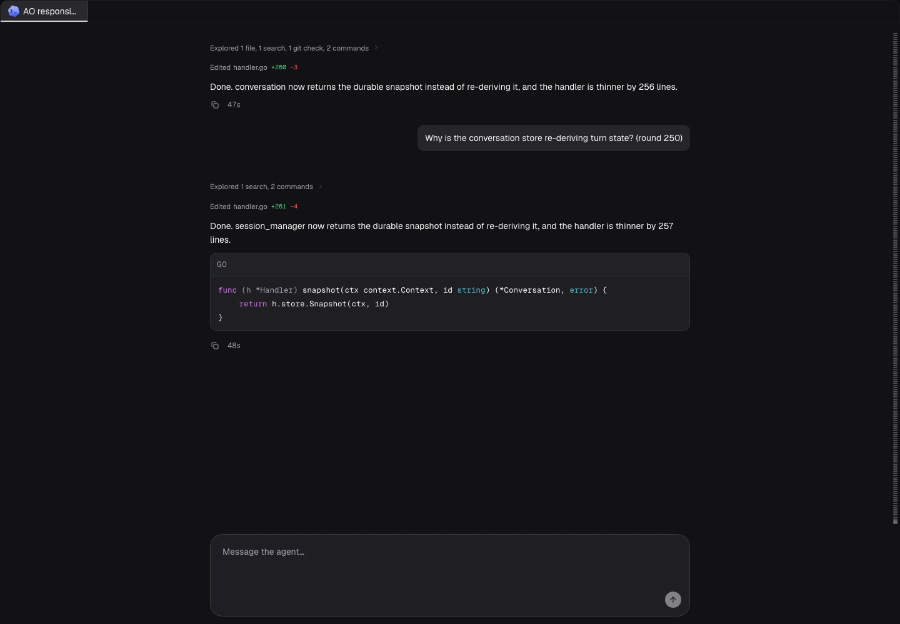
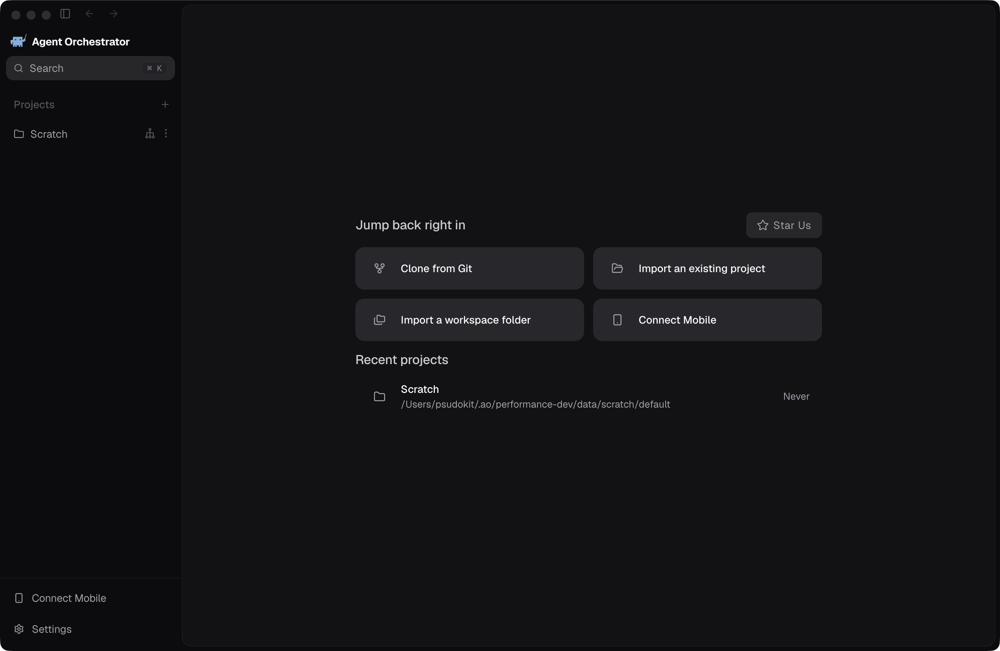

# Chat responsiveness

This change reduces AO's event-delivery and renderer overhead. It does not change provider inference, session lifecycle, daemon/API contracts, durable messages, approvals, model selection, or the chat layout.

## What was detected and changed

| Reproduction / finding | Change | Behavior retained |
| --- | --- | --- |
| CDC events arriving every 100 ms repeatedly reset the shared 150 ms debounce, delaying refresh until traffic stops. | Keep the first event's 150 ms deadline. Coalesce IDs, let active fetches finish, and queue a catch-up when an event predates their completion. | Targeted routing, full reconnect refresh, account/workspace boundaries, and durable snapshots. |
| Already-received text drains at 58–720 graphemes/second; long bursts stay buffered. `useRef` initializers also segment complete strings on each render. | Segment once per changed text; append only new graphemes; flush received backlog on the first animation frame at/after 200 ms from scheduling. | Initial snapshots, completed messages, visible-prefix corrections, Unicode reconciliation, copy, reduced motion, and the Markdown parser. |
| Scrolling scans and measures every loaded human-prompt anchor repeatedly. | Cache content-space positions; invalidate on content mutations, layout synchronization, dimensions, and resize observation. | Every loaded turn stays mounted. Find, selection, prompt spacing, pinning, and minimap navigation remain available. |
| Large syntax blocks run tokenization on the renderer despite an async function signature. | Use a lazy module worker above 20,000 characters with the same grammar engine. | Small warm synchronous highlights, grammar aliases, token output, escaping, source text, and copying. |

The worker has bounded pending work (32 jobs / 1,000,000 source characters) and a 10-second timeout. Worker failure, unsupported workers, or an oversized/saturated request leave readable plain code instead of performing expensive synchronous fallback. Colorization may therefore be omitted in these cases; source text is retained. Mermaid remains available and is untouched.

## Measurement method

The opt-in Playwright fixture imports the actual AO renderer components and event transport. It uses deterministic synthetic inputs and a fake Electron bridge; these are live browser measurements, **not real-provider latency measurements or a full packaged-app end-to-end test**.

- **Delivery:** 20 conversation CDC events, 100 ms apart, an active TanStack Query observer, and a simulated 30 ms query. Let the bridge's initial lifecycle refresh settle before the timed workload. Record actual fetch starts/completions and whether they occur before the stream ends.
- **Streaming:** deliver a 997 UTF-16-character Unicode burst after the initial snapshot. Record time until rendered text exactly matches the received string, then check completion restores the copy button. This measures received-to-DOM-visible lag; it does not instrument display scanout.
- **Highlighting:** warm the existing TypeScript grammar, highlight 10,000 lines (537,779 UTF-16 characters), and sample the main event loop every 4 ms. Record elapsed highlighting time separately from the worst callback gap. This isolates the tokenizer API and excludes React's rendering of the returned token tree. Worker startup/transfer is included.
- **Scrolling:** mount 250 fixture turns, wait for fonts/layout, then perform 120 scroll steps. Count actual anchor `getBoundingClientRect()` calls and record frame gaps. Assert all 250 anchors remain mounted. This measures repeated layout reads, not total app memory.

Baseline is commit `a96322315`. The identical fixture files are copied into the baseline checkout. Final measurements run serially with one Playwright worker, three repetitions per workload, without overlapping test/build jobs. Raw records include browser, Node version, OS/architecture, CPU count, viewport, timestamp, and every sampled gap. Three runs support descriptive medians/ranges, not population percentiles or a universal speedup claim. The host is a shared developer machine.

## Results

Apple M5, 10 logical CPUs, 24 GiB RAM; macOS arm64; Node 24.20.0; Chromium 148.0.7778.96; 1440 × 1000 viewport. Implementation source was `cc6042e71` (later commits package evidence and CI setup). Values are medians with three-run ranges. See [all raw samples](measurements.json).

| Measurement | Baseline | After |
| --- | ---: | ---: |
| First fetch start (ms) | 2,070.2 (2,069.5–2,071.7) | 151.6 (151.4–151.9) |
| Fetch starts during the stream | 0.0 (0.0–0.0) | 10.0 (10.0–10.0) |
| Received burst fully visible (ms) | 2,856.7 (2,850.6–2,857.8) | 213.3 (213.1–215.8) |
| Highlight maximum event-loop gap (ms) | 65.0 (63.0–68.9) | 27.2 (26.3–30.5) |
| Highlight total completion time (ms) | 62.6 (60.6–66.8) | 128.5 (125.1–160.2) |
| Anchor geometry reads | 60,001.0 (60,001.0–60,252.0) | 251.0 (251.0–251.0) |
| Maximum scroll frame gap per run (ms) | 25.8 (17.7–33.2) | 17.6 (16.7–25.0) |

Continuous traffic now causes ten fetches before the stream ends, rather than waiting for silence. Repeated anchor measurements fall by 99.6% while all 250 turns stay mounted.

**Tradeoff:** initial worker highlighting takes about twice as long overall, including startup/module loading and transfer in the Vite development renderer, while the worst main-thread gap is substantially lower. Plain code remains available while colorization is pending. The scroll frame-gap ranges overlap; this small sample supports reduced layout work, not a general FPS claim.

## Reproduce

From `frontend/`, using the lockfile dependencies and Playwright Chromium:

```sh
AO_PERF_BENCH=1 AO_PERF_LABEL=after AO_PERF_DIR="$HOME/.ao/validation/chat-performance" \
  AO_E2E_PORT=5292 CI=true npm run test:e2e -- \
  e2e/chat-performance.spec.ts --workers=1 --repeat-each=3
```

Create a detached baseline worktree at `a96322315`, install its lockfile dependencies, and copy `frontend/e2e/chat-performance.spec.ts` plus `frontend/e2e/performance/` into it. Repeat with `AO_PERF_LABEL=baseline` and another free port. Timings are intentionally not CI thresholds; unit regressions enforce scheduling, catch-up, cleanup, grapheme integrity, and geometry reuse.

## Verification

Local validation used Node 24.20.0 on macOS:

| Check | Result |
| --- | --- |
| Full frontend Vitest suite | 3,751 passed, 6 skipped, 275 files |
| Full renderer smoke suite (`@T0` / `@P0`) | 52 passed |
| Frontend and E2E TypeScript checks | Passed |
| Cloud client generation/drift, typecheck, tests, build, package dry-run | Passed |
| Product UI typecheck, tests, build, package dry-run | Passed |
| Pinned agent-browser runtime preparation | Passed; used by full frontend tests |
| Production Vite renderer build | Passed; separate 72 KB highlighting worker emitted |
| Built worker under Electron / `app://` / production CSP | Passed |
| Before/after controlled browser workloads | 12 runs per checkout; text and mounted-turn integrity checked |
| Gitleaks v7.4.0 with the workflow config and PR commit list | 9 commits scanned; no leaks |

The first remote renderer-smoke run exposed a clean-install gap: the benchmark fixture imports real renderer components and shared product-ui source, but that job did not install product-ui dependencies. The workflow now installs them before E2E typechecking. Removing those dependencies locally reproduced the failure; the exact new install step restored passing typechecks, followed by all 52 renderer smoke tests passing.

One initial complete Vitest run missed the unchanged settings form's temporary “Saved” indicator (3,750 passed / 1 failed). The full 40-test settings file passed separately on both baseline and branch, then the complete suite passed on rerun. Early overlapping browser runs timed out at startup under host swapping; the final full browser suite ran serially and passed. Initial native dependency setup also needed the pinned Electron binary and a Node 24 SQLite rebuild; these environment repairs changed no dependency manifest or lockfile.

The requested `npx @redwoodjs/agent-ci run --all` wrapper stopped before dispatch because the release-artifact workflow requires `VITE_WORKOS_CLIENT_ID`. No release/publishing job was executed. Docker became unavailable before the secret scan, so the pinned Gitleaks v7.4.0 source was built locally and run against a normal disposable clone; the scanner reported all nine PR commits scanned. Applicable frontend workflow commands were therefore run directly; the remote Linux checks remain authoritative for their runner (see the PR Checks tab). Backend/API, mobile, and release-platform workflows are outside this frontend-only diff's path triggers.


Native development smoke used an isolated daemon at `127.0.0.1:5322`, renderer at `localhost:5174`, and data/profile/run state under `~/.ao/performance-dev`. The actual Electron window displayed the home screen, and `/api/v1/projects` plus `/api/v1/sessions` returned 200. No existing AO project/session was changed. `ao preview` was attempted but correctly refused because this Codex task has no `AO_SESSION_ID`.

A separate Electron 33.4.11 smoke loaded the built highlighting worker over `app://renderer`, using AO's scheme privileges and the generated production CSP without relaxing it. The returned token tree preserved all 51,000 source characters; see [worker result](built-worker-smoke.json). This tests packaged-origin worker compatibility, not an installer or signed release.

## Screenshots

No layout redesign is included. The before/after images show the same long-chat fixture; the native image identifies the isolated app smoke.

| Before | After |
| --- | --- |
|  |  |



## Deliberate limits

History still refreshes in full. CDC currently identifies the conversation but not which item/range changed; old running tools and rewritten branches can change outside the newest page. Replacing only the newest page can also skip an item at a shifted pagination boundary. Safe incremental history needs an explicit version/change-scope contract, not a frontend shortcut.

Transcript virtualization and incremental Markdown parsing are excluded because they could change find/selection and cross-block Markdown behavior. Persistence timing is unchanged. The 200 ms streaming limit is a scheduling target: a blocked/hidden renderer can only display text when the browser schedules a frame.
