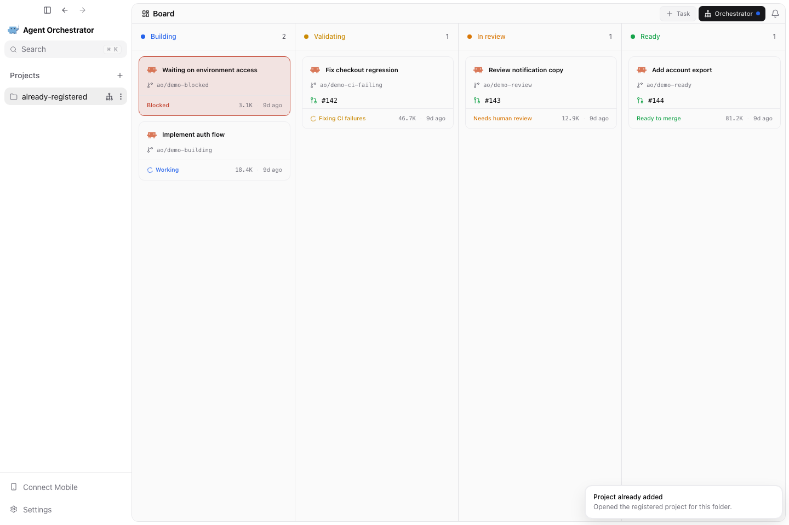

# PR #4926 visual evidence

Captured 2026-09-05.

Captured from this PR’s actual React renderer using deterministic daemon/native-bridge fixtures at 1440×960. These show the UI regression states; they are not live-provider or packaged-Electron execution evidence. Local dependency symlinks caused the renderer to use fallback fonts.

Duplicate import opens the registered project and confirms the recovery in a toast.

