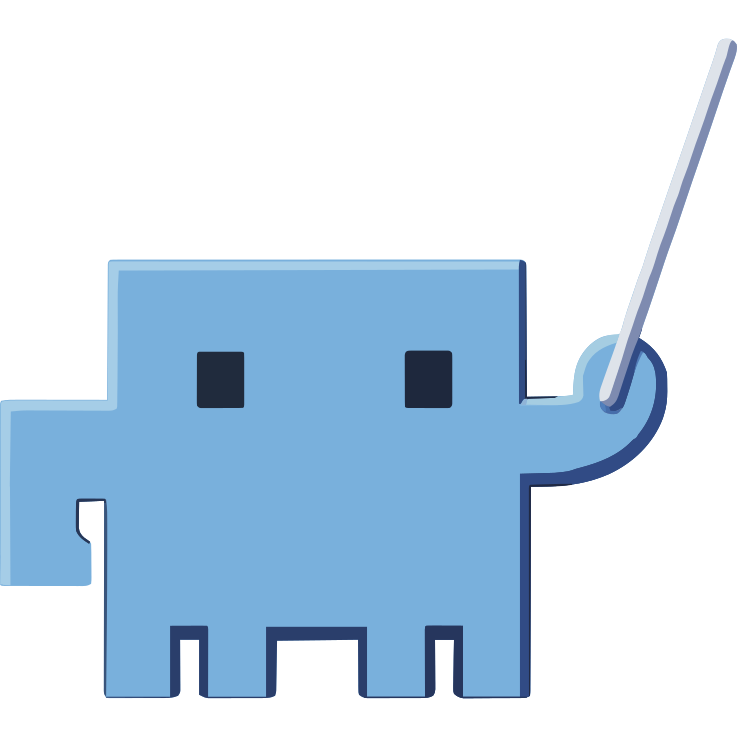
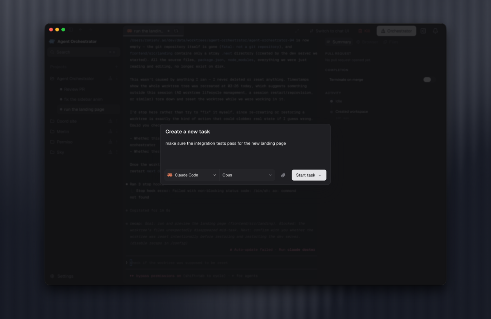
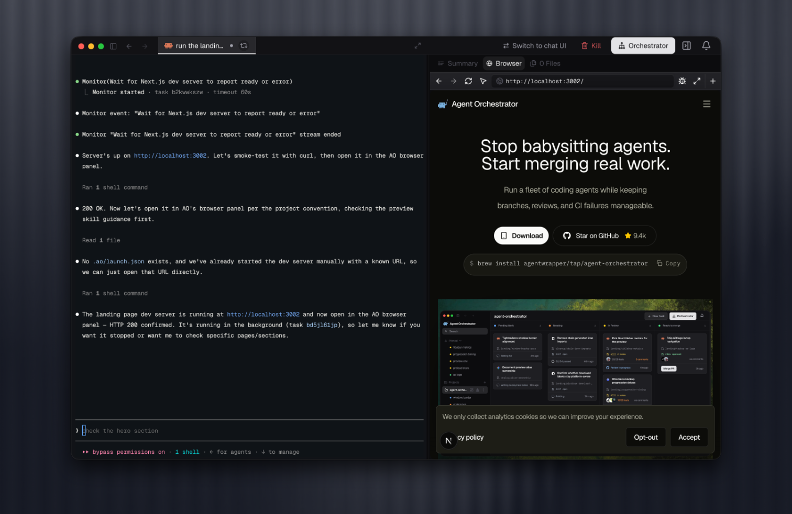

<div align="center">
  

### Agent Orchestrator

#### 集中规划、运行和监督编程智能体。

[](https://github.com/Untrivial-ai/agent-orchestrator/stargazers)

[](https://github.com/Untrivial-ai/agent-orchestrator/releases/latest)
[](https://github.com/Untrivial-ai/agent-orchestrator/releases)
[](../LICENSE)
[](https://x.com/aoagents)
[](https://discord.com/invite/UZv7JjxbwG)

让每个编程任务都有自己的智能体、工作区和反馈闭环。<br />
通过了解项目上下文的编排器规划和委派更大的目标。<br />
在实时看板中跟踪每个 worker、拉取请求、CI 运行和评审。

[**下载 AO**](#安装) &nbsp;&bull;&nbsp; [文档](https://aoagents.dev/docs) &nbsp;&bull;&nbsp; [版本](https://github.com/Untrivial-ai/agent-orchestrator/releases) &nbsp;&bull;&nbsp; [参与贡献](../CONTRIBUTING.md) &nbsp;&bull;&nbsp; [Discord](https://discord.com/invite/UZv7JjxbwG)

[English](../README.md) · **简体中文** · [日本語](README.ja.md) · [한국어](README.ko.md) · [Español](README.es.md) · [Français](README.fr.md) · [Deutsch](README.de.md) · [Português (Brasil)](README.pt-BR.md)

<br />


</div>

## 面向智能体驱动开发的工作区

一个编程智能体可以完成一项任务。当多个智能体同时参与一个项目时，你需要解决的是另一类工作：判断什么最重要，清晰地拆分任务，为每个智能体提供正确的上下文，避免分支冲突，并跟踪每项变更直至评审和合并。

AO 是为此打造的本地桌面工作区。添加一个仓库，然后根据任务选择合适的编程智能体、模型和交互界面来创建 worker 会话。对于使用 Git 的工作，AO 会为每个 worker 分配独立的分支和 worktree。从开始到结束，任务、对话、终端、变更文件、浏览器预览、拉取请求、CI 和评审状态始终与该会话关联。

在桌面应用背后，AO 的本地守护进程会监视智能体活动和源代码管理状态。你看到的是项目统一且实时的全局视图，而不是彼此割裂的终端、分支和浏览器标签页。


## Worker 执行专注、明确的任务

Worker 是 AO 的执行单元：一项任务、一个编程智能体和一个隔离工作区。当工作已经明确时，使用 **New task**。描述期望结果，选择智能体和模型，附上相关文件，然后通过结构化 Chat 或智能体原生的终端界面与其协作。

你可以随时打开 worker，继续对话、连接终端、检查变更、使用隔离浏览器、查看拉取请求，或把 CI 和评审反馈交还给同一个智能体。这样，每项任务都能独立理解，并行工作也不会挤进同一个共享上下文。



## 项目编排器负责全局规划

项目编排器是 AO 中持久存在的规划与协调智能体。它工作在单项任务之上，关注整个仓库的产品方向、技术策略、优先级和工作顺序。

你可以在实施之前用编排器探索想法、讨论产品和技术方案、分析取舍、识别高影响力工作，并把模糊的目标转化为具体计划。项目级对话会保留目标、决策、约束和之前的推理。编排器将这些规划历史与仓库上下文及 AO 的实时状态结合起来，其中包括活跃 worker、任务归属、拉取请求、CI 和评审。这让规划既立足于项目全局，也始终反映正在进行的工作。

当计划可以付诸执行时，编排器能够将其拆成专注的任务，启动或重定向 worker，把相关上下文交给每个 worker，跟踪进展并协调后续工作。编排器负责规划和委派；worker 负责实现、测试、提交和拉取请求。


## 看板让整个系统一目了然

无论 worker 是通过 **New task** 创建，还是由编排器委派，它都会出现在同一个实时看板上。AO 根据会话、拉取请求、CI 和评审的实际状态决定每张卡片的位置，让看板成为项目的运行视图：

- **Working（处理中）：** 正在实施工作或可以接收下一条指令的 worker
- **Needs you（需要你）：** 被阻塞、缺少输入、CI 失败、被要求修改或信号丢失的会话
- **In review（评审中）：** 正在等待检查或评审的已打开拉取请求和草稿拉取请求
- **Ready to merge（可以合并）：** 已获批准或可合并的工作；已合并的会话会保持可见，直到被归档

每张卡片都把任务、智能体、分支、活动、拉取请求和状态放在一起。打开卡片即可查看对话或终端、变更文件、PR 摘要、评审和预览。看板会告诉你哪些工作正在推进，哪些工作被阻塞，以及你的注意力放在哪里能产生最大影响。


## 从想法到合并，一套完整工作流

1. **从正确的层级开始。** 将明确的任务直接交给 worker，或者与项目编排器一起梳理更大的目标并由它形成计划。
2. **委派专注的工作。** 你可以自己启动 worker，也可以让编排器带着所需的上下文和明确的责任归属来创建 worker。
3. **在隔离环境中构建。** 每个使用 Git 的 worker 都有自己的分支和 worktree；Scratch worker 则使用由 AO 管理的无分支目录。
4. **监督实时状态。** AO 跟踪智能体活动、拉取请求、CI、评审反馈和合并冲突，并在看板中反映这些事实。
5. **闭合反馈循环。** 直接检查任意 worker，与编排器一起做出项目层面的决策，再把可操作的失败信息或评审意见交还给负责该工作的智能体。

AO 与你现有的编程智能体和源代码管理流程配合使用。智能体保留各自的原生优势；AO 提供项目上下文、隔离执行、协调能力和运行视图，让这些智能体能够作为一个系统协同工作。

## 产品亮点

<table>
  <tr>
    <td width="36%" valign="middle">
      <h3>拉取请求和智能体评审</h3>
      <p>将 CI、可合并状态、评审者状态和交互式智能体评审放在 worker 旁边，再把要求的修改交还给同一个负责人。</p>
    </td>
    <td width="64%">
      
    </td>
  </tr>
  <tr>
    <td width="36%" valign="middle">
      <h3>可由智能体控制的浏览器</h3>
      <p>在 worker 界面旁预览和检查本地应用。每个 worker 都有隔离的浏览器配置，因此并行的界面任务不会共享状态。</p>
    </td>
    <td width="64%">
      
    </td>
  </tr>
  <tr>
    <td width="36%" valign="middle">
      <h3>原生界面，由一个监督层统一管理</h3>
      <p>使用结构化 Chat 或智能体原生终端界面，同时让 AO 将任务上下文、工作区状态和反馈集中在一个地方。</p>
    </td>
    <td width="64%">
      
    </td>
  </tr>
</table>

## 支持的智能体

**支持 26 种编程智能体**，全部纳入同一个受监督的工作流。

<table>
  <tr valign="middle">
    <td width="33%" valign="middle" nowrap> &nbsp; <b>Claude Code</b></td>
    <td width="33%" valign="middle" nowrap> &nbsp; <b>Codex</b></td>
    <td width="33%" valign="middle" nowrap> &nbsp; <b>Cursor</b></td>
  </tr>
  <tr valign="middle">
    <td valign="middle" nowrap> &nbsp; <b>opencode</b></td>
    <td valign="middle" nowrap> &nbsp; <b>Aider</b></td>
    <td valign="middle" nowrap> &nbsp; <b>GitHub Copilot</b></td>
  </tr>
  <tr valign="middle">
    <td valign="middle" nowrap> &nbsp; <b>Grok</b></td>
    <td valign="middle" nowrap> &nbsp; <b>Kimi</b></td>
    <td valign="middle" nowrap> &nbsp; <b>Pi</b></td>
  </tr>
  <tr valign="middle">
    <td valign="middle" nowrap> &nbsp; <b>Amp</b></td>
    <td valign="middle" nowrap> &nbsp; <b>Auggie</b></td>
    <td valign="middle" nowrap> &nbsp; <b>Droid</b></td>
  </tr>
  <tr valign="middle">
    <td valign="middle" nowrap> &nbsp; <b>Crush</b></td>
    <td valign="middle" nowrap> &nbsp; <b>Cline</b></td>
    <td valign="middle" nowrap> &nbsp; <b>Goose</b></td>
  </tr>
  <tr valign="middle">
    <td valign="middle" nowrap> &nbsp; <b>Qwen</b></td>
    <td valign="middle" nowrap> &nbsp; <b>Continue</b></td>
    <td valign="middle" nowrap> &nbsp; <b>Devin</b></td>
  </tr>
  <tr valign="middle">
    <td valign="middle" nowrap> &nbsp; <b>Kiro</b></td>
    <td valign="middle" nowrap> &nbsp; <b>Kilo Code</b></td>
    <td valign="middle" nowrap> &nbsp; <b>Vibe</b></td>
  </tr>
  <tr valign="middle">
    <td valign="middle" nowrap> &nbsp; <b>Muse</b></td>
    <td valign="middle" nowrap> &nbsp; <b>Agy</b></td>
    <td valign="middle" nowrap><picture><source media="(prefers-color-scheme: dark)" srcset="../docs/assets/readme/agents/autohand-stacked-dark.png" /></picture> <b>Autohand</b></td>
  </tr>
  <tr valign="middle">
    <td valign="middle" nowrap> &nbsp; <b>Kimchi</b></td>
    <td valign="middle" nowrap> &nbsp; <b>Prime Agent</b></td>
    <td valign="middle" nowrap></td>
  </tr>
</table>

[浏览智能体设置指南 →](https://aoagents.dev/docs/plugins/agents)

**根据当下的需要选择交互方式：结构化 Chat 或智能体原生的终端界面。**

## 安装

下载适用于你所在平台的最新 AO 桌面应用。AO 会自动检查更新。

| 平台                   | 下载                                                                                                                      |
| ---------------------- | ------------------------------------------------------------------------------------------------------------------------- |
| macOS（Apple 芯片）    | [下载](https://github.com/Untrivial-ai/agent-orchestrator/releases/latest/download/agent-orchestrator-darwin-arm64.dmg)   |
| macOS（Intel）         | [下载](https://github.com/Untrivial-ai/agent-orchestrator/releases/latest/download/agent-orchestrator-darwin-x64.dmg)     |
| Windows                | [下载](https://github.com/Untrivial-ai/agent-orchestrator/releases/latest/download/agent-orchestrator-win32-x64.exe)      |
| Linux（AppImage）      | [下载](https://github.com/Untrivial-ai/agent-orchestrator/releases/latest/download/agent-orchestrator-linux-x64.AppImage) |
| Linux（Debian/Ubuntu） | [下载](https://github.com/Untrivial-ai/agent-orchestrator/releases/latest/download/agent-orchestrator-linux-x64.deb)      |
| Linux（Fedora/RHEL）   | [下载](https://github.com/Untrivial-ai/agent-orchestrator/releases/latest/download/agent-orchestrator-linux-x64.rpm)      |

打开 Agent Orchestrator，并选择你希望 AO 管理的仓库。桌面应用会为你运行守护进程，因此无需使用 CLI。有关智能体 CLI 的设置和故障排除，请参阅[安装指南](https://aoagents.dev/docs/installation)。

## 报告 bug

推荐的 bug 报告方式是让你的编程智能体遵循仓库中的 [bug-triage skill](https://github.com/Untrivial-ai/agent-orchestrator/blob/main/.agents/skills/bug-triage/SKILL.md)。它会指导智能体在当前代码上复现问题、收集诊断信息、跟踪相关代码路径、搜索重复 issue，并提交或更新一份详细的 GitHub issue。

无论你使用本地编程智能体，还是 Discord 上的 AO Bot，都请附上截图并尽可能提供完整的相关信息。说明发生了什么、在何时何处发生、复现步骤、操作系统和 AO 版本，以及问题是每次都会出现还是偶尔出现。这样智能体才更有可能复现 bug，并提交一份具有可操作性的报告。

```text
请阅读以下 skill 并遵循其中的说明：
https://github.com/Untrivial-ai/agent-orchestrator/blob/main/.agents/skills/bug-triage/SKILL.md
请复现并分诊这个 bug，然后提交或更新 GitHub issue。上下文：<发生了什么、时间、位置、复现步骤、操作系统、AO 版本和出现频率>。截图：<附上所有可用截图>。
```

你也可以在 Discord 的 [bug-triaging 频道](https://discord.com/channels/1476302178913357958/1491735678156013588)中报告 bug。标记 `@AO Bot#8425`，描述发生了什么，并要求它使用 bug-triage skill。

```text
@AO Bot#8425 请使用 bug-triage skill 复现并分诊这个 bug，然后提交或更新 GitHub issue。上下文：<发生了什么、时间、位置、复现步骤、操作系统、AO 版本和出现频率>。截图：<附上所有可用截图>。
```

## 开发与贡献

欢迎贡献代码、文档、bug 分诊、示例和测试。

```bash
git clone https://github.com/Untrivial-ai/agent-orchestrator.git
cd agent-orchestrator
```

请先阅读[开发指南](../docs/development.md)，了解先决条件、本地设置和测试命令。提交拉取请求前请阅读 [CONTRIBUTING.md](../CONTRIBUTING.md)，并通过 [GitHub Issues](https://github.com/Untrivial-ai/agent-orchestrator/issues) 报告 bug 和提出功能请求。

## 文档

| 文档                                                                | 需要以下内容时从这里开始                                      |
| ------------------------------------------------------------------- | ------------------------------------------------------------- |
| [产品文档](https://aoagents.dev/docs)                               | 安装、智能体设置和日常产品使用。                              |
| [docs/architecture.md](../docs/architecture.md)                     | 后端心智模型、生命周期、持久化、CDC、状态推导和守护进程边界。 |
| [docs/backend-code-structure.md](../docs/backend-code-structure.md) | 包职责以及各项后端关注点应归属的位置。                        |
| [docs/cli/README.md](../docs/cli/README.md)                         | CLI 行为和守护进程路由映射。                                  |
| [docs/development.md](../docs/development.md)                       | 本地开发的先决条件、构建步骤、测试运行方法和故障排除。        |
| [docs/STATUS.md](../docs/STATUS.md)                                 | `main` 当前已提供的功能和尚在开发中的内容。                   |

## 关注 AO 的进展

<table>
  <tr>
    <td width="50%" align="center">
      <a href="https://x.com/agent_wrapper/status/2026329204405723180">
        
      </a>
    </td>
    <td width="50%" align="center">
      <a href="https://x.com/agent_wrapper/status/2025986105485733945">
        
      </a>
    </td>
  </tr>
</table>

## 社区

加入 [Discord](https://discord.com/invite/UZv7JjxbwG) 获取帮助并参与贡献者讨论，关注 [@aoagents](https://x.com/aoagents) 了解最新动态，或在 [GitHub Issues](https://github.com/Untrivial-ai/agent-orchestrator/issues) 中发起讨论。

## 匿名遥测

AO 使用注重隐私的产品使用和可靠性指标，这些指标在设计上排除了个人身份信息及项目内容。它们帮助我们了解产品采用情况并改进产品。[进一步了解遥测和隐私](../docs/telemetry.md)。

## 许可证

Agent Orchestrator 基于 [Apache License 2.0](../LICENSE) 提供。
